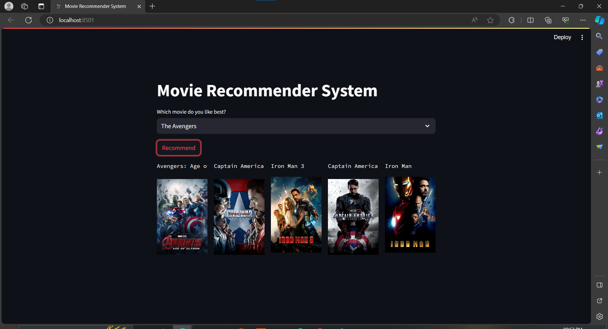
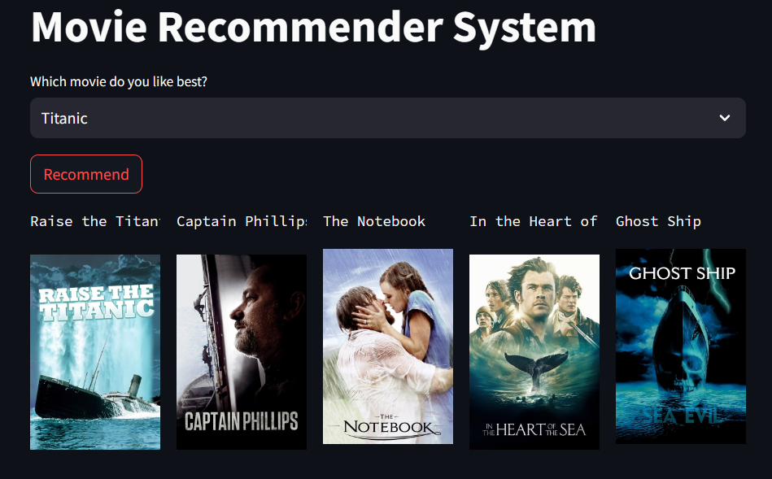

# Movie Recommender System


## Project Overview

This project encompasses the development of a Movie Recommender System, which recommends user Five similar movies to the selected Movies. The project involves data preprocessing, model building, and the creation of a web-based interface using Streamlit. The entire process includes the following steps:

1. **Dataset** : The dataset used for this project is sourced from [TMDB Movie Metadata on Kaggle](https://www.kaggle.com/tmdb/tmdb-movie-metadata). It provides comprehensive information about movies, including features such as cast, crew, budget, and genres. 
2. **Preprocessing**:
         - The data was processed using python which icluded keeping the relevant columns, obtaining required values, and concatenating them into a string (tag) for model input.
         - A deatiled explation of the preprocessing can be found in the [Google Colab File](Movie_Recommender_System.ipynb)
4. **Model**: Building and training the recommender model.
5. **Website**: Developing a Streamlit-based web application for user interaction.
6. **Deployment**: Deploy the system using Streamlit Cloud to make recommendations accessible.

# Pickle Files:
In the Streamlit file (app.py) , in the lines 32 and 33 , similarity.pkl and movie_dict.pkl files are required which are generated from the preprocessing step. Due to GitHub's file size limitations, it couldn't be directly uploaded to the repository. Instead, it can be downloaded the from the [Google Drive link](https://drive.google.com/drive/folders/1w-J3A8qtLvh8E39uqbLmp0AzqWTcmjSt?usp=drive_link)
 


## Screenshots





```python

